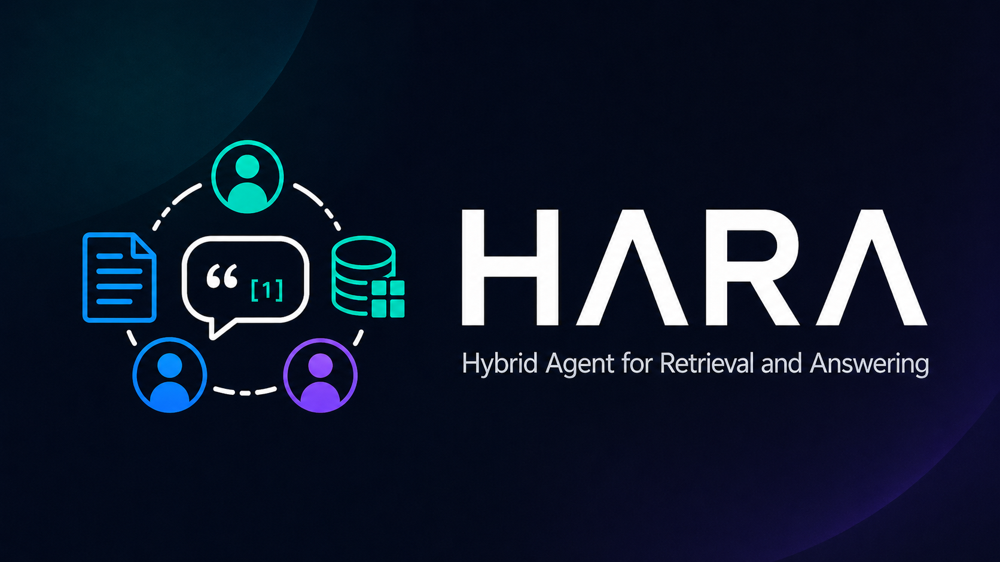
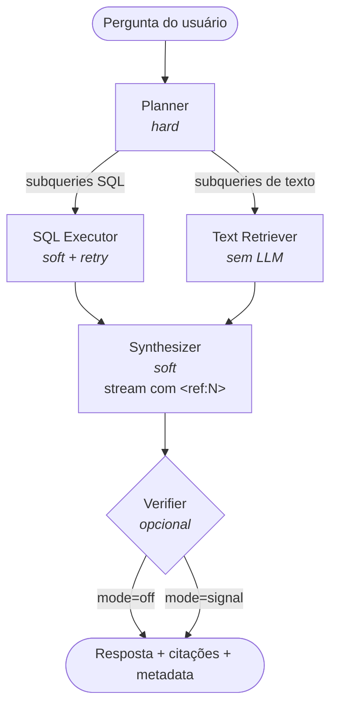

<div align="center">



# HARA

**Hybrid Agent for Retrieval and Answering**

*One question. Structured data + unstructured text. One grounded answer.*


</div>

---

## Visão geral

HARA é um sistema multi-agent open-source para Q&A híbrido sobre dados estruturados (CSV → SQL) e não-estruturados (PDFs, DOCX, Markdown, TXT → vector store), gerando respostas com citações estruturadas via marcadores `<ref:N>`. Self-hosted e single-process, é o artefato prático da dissertação de mestrado de Fabricio Zillig (Universidade Presbiteriana Mackenzie, 2026) e tem como diferencial fundamental unificar evidências tabulares e textuais em uma única resposta coerente — sem fragmentar a busca entre dois sistemas separados. Construído sobre LangGraph, LangChain e FastAPI, HARA é projetado para ser extensível, auditável e pronto para produção.

## Recursos

- Pipeline multi-agent LangGraph: Planner → SQL Executor / Text Retriever → Synthesizer → Verifier (opcional)
- Multi-turn com reuso implícito de evidências entre turnos da mesma thread
- Streaming via SSE com marcadores `<ref:N>` extraídos deterministicamente pelo Synthesizer
- SQL safety formal: validação de AST com sqlglot, injeção de `LIMIT`, enforcement read-only, table allowlist e blocklist de funções perigosas
- Connectors plugáveis via Python entry-points (built-in: SQLite, PostgreSQL, ChromaDB, in-memory)
- 5 providers LLM + 3 providers de embeddings nativos (OpenAI, Anthropic, Google, OpenRouter, Ollama; embeddings: OpenAI, Google, Ollama)
- Override de modelo por nó da pipeline (`[models.planner]`, `[models.synthesizer]`, etc.)
- API REST + SSE com OpenAPI automático, Bearer auth e CORS configurável
- Setup wizard interativo (`hara init`) com 9 prompts guiados
- 509 testes unitários e de integração, 85% de cobertura; tipagem pyright strict; linting com ruff

## Arquitetura



O Planner decompõe a pergunta em subqueries e as roteia — em paralelo — para o SQL Executor e o Text Retriever. O Synthesizer consome todas as evidências e transmite a resposta inserindo marcadores `<ref:N>` de forma determinística. O Verifier, quando habilitado (`mode=signal`), pontua a resposta gerada sem bloquear o stream.

## Início rápido

```bash
pip install hara[all]
hara init                # escreve hara.toml + .env via wizard interativo
hara serve               # sobe a API em :8000
```

Teste com curl:

```bash
curl -X POST -H "Authorization: Bearer $TOKEN" \
     -H "Content-Type: application/json" \
     -d '{"message": "Qual o total de vendas por região em 2024?"}' \
     http://localhost:8000/invoke
```

## Referência da CLI

| Comando | Descrição |
|---|---|
| `hara init` | Wizard de setup interativo (9 prompts; `--non-interactive` para CI) |
| `hara doctor` | Valida config + conectividade (LLM, embeddings, SQL, vector) |
| `hara ingest --from <path>` | Ingere CSVs (→ SQL) e PDFs/DOCX/MD/TXT (→ vector store) |
| `hara semantic-map [--force]` | Gera `structured.yaml` + `unstructured.yaml` |
| `hara serve [--host --port]` | Sobe o servidor FastAPI (força `--workers=1`) |
| `hara chat [<pergunta>]` | Conversa one-shot ou REPL local |
| `hara connectors list` | Lista connectors built-in, via entry-points e programáticos |
| `hara providers list` | Idem para providers LLM e de embeddings |
| `hara version` | Exibe a versão do pacote |

## Referência rápida da API

| Endpoint | Descrição |
|---|---|
| `POST /invoke` | Conveniência síncrona: envia uma mensagem, bloqueia até a resposta e retorna JSON |
| `POST /stream` | Wrapper SSE do `/invoke` — emite eventos `state`, `token`, `final`, `done` |
| `POST /threads/{id}/messages` | Assíncrono: retorna `202` com `turn_id`; cliente faz polling ou assina eventos |
| `GET /threads/{id}/turns/{id}/events` | Stream SSE (replay-then-tail) de um turno |
| `DELETE /threads/{id}/turns/{id}` | Cancela um turno em progresso |
| `GET /doctor` | Health checks como JSON (`200 ok` / `503 degraded`) |

Referência completa: [`docs/api.md`](docs/api.md).

## Configuração

O HARA é configurado via `hara.toml` (gerado por `hara init`) com suporte a override por variável de ambiente. As seções principais são `[models]` (com override por nó, ex.: `[models.planner]`), `[connectors]` (SQL e vector), `[providers]` (LLM e embeddings), `[verifier]` (campo `mode`: `off`, `signal` ou `strict`) e `[paths]` (ex.: `data_dir`). Qualquer campo pode ser sobrescrito via env var com notação de duplo underscore — por exemplo, `MODELS__HARD__MODEL=gpt-4o-mini`. Consulte [`docs/configuration.md`](docs/configuration.md) para referência completa de todos os campos.

## Documentação

- [Primeiros passos](docs/getting-started.md) — walkthrough end-to-end do zero
- [Configuração](docs/configuration.md) — todos os campos do `hara.toml`
- [Referência da API](docs/api.md) — endpoints, schemas e exemplos com curl
- [Arquitetura](docs/architecture.md) — design da pipeline e decisões técnicas
- [Deployment](docs/deployment.md) — checklist de produção
- [Troubleshooting](docs/troubleshooting.md) — erros comuns e como resolvê-los
- [Estendendo connectors](docs/extending/connectors.md) — como escrever um connector próprio

## Como contribuir

Contribuições são bem-vindas — seja via bug report, feature request ou pull request. Por favor, leia [`CONTRIBUTING.md`](CONTRIBUTING.md) antes de abrir um PR: ele cobre o setup do ambiente de desenvolvimento, a convenção de commits, como rodar os testes (`pytest`) e o fluxo de revisão. Para mudanças maiores, abra uma issue primeiro para alinhar o escopo.

## Licença

Distribuído sob a licença MIT. Veja [`LICENSE`](LICENSE) para detalhes.

## Como citar o HARA

Se você usa o HARA em pesquisa ou produto, por favor cite tanto o software quanto a dissertação que originou a arquitetura. Um arquivo [`CITATION.cff`](CITATION.cff) está disponível na raiz do repositório (o GitHub renderiza um botão *Cite this repository* no header).

```bibtex
@software{hara2026,
  author  = {Zillig, Fabricio},
  title   = {{HARA}: Hybrid Agent for Retrieval and Answering},
  year    = {2026},
  version = {0.1.0},
  url     = {https://github.com/z-fab/hara}
}

@mastersthesis{zillig2026hara,
  author  = {Zillig, Fabricio},
  title   = {Arquitetura Multiagente Baseada em Modelos de Linguagem para Recupera\c{c}\~ao H\'ibrida de Informa\c{c}\~ao},
  school  = {Universidade Presbiteriana Mackenzie},
  year    = {2026},
  type    = {Disserta\c{c}\~ao de Mestrado},
  address = {S\~ao Paulo, Brasil}
}
```

## Agradecimentos

HARA é o desdobramento prático da dissertação de mestrado de Fabricio Zillig — *Arquitetura Multiagente Baseada em Modelos de Linguagem para Recuperação Híbrida de Informação* (Universidade Presbiteriana Mackenzie, 2026). A arquitetura aqui empacotada é a configuração consolidada a partir dos experimentos: Planner + SQL Retriever + Text Retriever + síntese direta com citações estruturadas, e Verifier opcional em modo de sinalização — equilíbrio entre qualidade, rastreabilidade e custo operacional observado na avaliação.

**Artefatos de pesquisa:**
- 📊 [`z-fab/pesquisa-rag-hibrido`](https://github.com/z-fab/pesquisa-rag-hibrido) — código dos experimentos da dissertação (PoC, ablations, scripts de avaliação)
- 📚 [`z-fab/agro-rag-dataset`](https://github.com/z-fab/agro-rag-dataset) — dataset agrícola usado na avaliação (consultas, fontes estruturadas e documentos)

Construído sobre [LangGraph](https://github.com/langchain-ai/langgraph), [LangChain](https://github.com/langchain-ai/langchain), [FastAPI](https://github.com/fastapi/fastapi), [Pydantic](https://github.com/pydantic/pydantic), [sqlglot](https://github.com/tobymao/sqlglot), [ChromaDB](https://github.com/chroma-core/chroma) e [Polars](https://github.com/pola-rs/polars).
