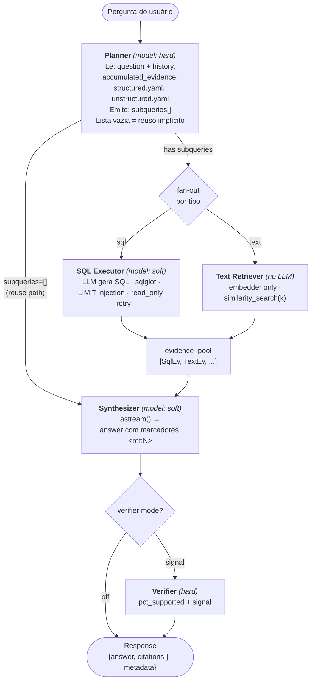

# Arquitetura

HARA — Hybrid Agent for Retrieval and Answering — é um agente de Q&A que combina retrieval estruturado (SQL) e não-estruturado (vector embedding) em uma única pipeline [LangGraph](https://github.com/langchain-ai/langgraph). Toda pergunta passa pelo Planner, que a decompõe em sub-queries tipadas; cada sub-query é executada em paralelo pelo branch correto (SQL Executor ou Text Retriever); o Synthesizer unifica os resultados em prosa com marcadores `<ref:N>` inline; e o orquestrador extrai as citações em pós-processamento. O resultado final é sempre `{answer, citations[], metadata}`.

## Índice

1. [Visão geral](#1-visão-geral)
2. [Estado (`AgentState`)](#2-estado-agentstate)
3. [Protocolo de marcadores — `<ref:N>`](#3-protocolo-de-marcadores--refn)
4. [Multi-turn e reuso](#4-multi-turn-e-reuso)
5. [SQL safety — 3 camadas](#5-sql-safety--3-camadas)
6. [Extensibilidade de connectors e providers](#6-extensibilidade-de-connectors-e-providers)
7. [Superfície da API HTTP](#7-superfície-da-api-http)
8. [Modelo de processo](#8-modelo-de-processo)
9. [Persistência de estado](#9-persistência-de-estado)
10. [Decisões de design](#10-decisões-de-design)
11. [Onde fica o código](#11-onde-fica-o-código)

---

## 1. Visão geral



O grafo é compilado pelo `build_graph()` em `agent/graph.py` e recebe os nós como callables puras — sem dependências internas. O `Orchestrator` em `agent/orchestrator.py` faz o partial-apply de cada nó com seus conectores e LLMs antes de compilar o grafo.

---

## 2. Estado (`AgentState`)

O estado é um `TypedDict` que flui por todos os nós. Campos principais:

| Campo | Tipo | Descrição |
|---|---|---|
| `question` | `str` | Pergunta do usuário no turno atual |
| `history` | `list[Message]` | Últimos N turnos (user + assistant) |
| `accumulated_evidence` | `list[Evidence]` | Pool do turno anterior (multi-turn) |
| `subqueries` | `list[SubQuery]` | Output do Planner; vazio = reuse |
| `routes_taken` | `set[str]` | `{"sql"}`, `{"text"}`, `{"sql","text"}` ou `set()` |
| `sql_results` | `list[dict]` | Linhas brutas do SQL Executor |
| `text_results` | `list[dict]` | Chunks do Text Retriever |
| `evidence_pool` | `list[Evidence]` | Pool numerado que o Synthesizer viu |
| `answer_text` | `str` | Texto completo gerado pelo Synthesizer |
| `verifier_signal` | `VerifierSignal \| None` | Score do Verifier (quando ativo) |
| `tokens` | `Annotated[TokenUsage, reducer]` | Soma acumulada via reducer aditivo |
| `latency_per_node` | `Annotated[dict, reducer]` | Last-write-wins por nó |

Os campos `tokens` e `latency_per_node` usam `Annotated[X, reducer]` do LangGraph: cada nó retorna um delta parcial e o LangGraph aplica o reducer para consolidar no estado final sem que um nó precise ler o valor anterior.

---

## 3. Protocolo de marcadores — `<ref:N>`

O Synthesizer recebe um `evidence_pool` com evidências numeradas (IDs inteiros sequenciais). O prompt instrui o modelo a emitir marcadores `<ref:N>` inline na prosa — por exemplo: "O faturamento foi R$42k em março <ref:3>."

**Por que `<ref:N>` e não `[1]`?** O padrão `[N]` colide com Markdown (links, notas de rodapé). O regex `<ref:(\d+)>` é inequívoco e dígitos-only.

Fluxo pós-stream (implementado em `agent/markers.py`):

1. `extract_marker_ids(text)` — regex `<ref:(\d+)>`, retorna IDs em ordem de primeira aparição, deduplicados.
2. `build_citations(text, pool)` — filtra o pool pelos IDs encontrados; retorna `list[Citation]`.
3. `count_unsupported_markers(text, pool_ids)` — conta `<ref:N>` onde N não existe no pool; vai para `metadata.unsupported_markers`.

**Edge cases:**
- `<ref:1>` aparece 3× → uma entrada em `citations[]` (dedup by id).
- `<ref:99>` mas pool só tem 1..3 → contado em `unsupported_markers`; texto preservado.
- `<ref:>` ou `<ref:abc>` → ignorados pelo regex (só aceita `\d+`).
- Evidência no pool sem marcador correspondente → não aparece em `citations[]`.

**Por que markers em vez de structured output direto?** `structured_output` inviabiliza `astream()`. Com markers o Synthesizer pode transmitir token a token em tempo real, e a extração de citações acontece apenas uma vez após o stream completar.

---

## 4. Multi-turn e reuso

`[agent].max_history_turns` (padrão: `5`) controla quantos turnos anteriores o Planner enxerga como `history` (pares user/assistant em ordem cronológica).

Além do histórico textual, o pool de evidências do turno anterior é serializado em `metadata["_evidence_pool"]` (chave prefixada com `_`; a API filtra chaves `_`-prefixadas antes de serializar a resposta pública). No próximo turno, o orquestrador carrega esse pool como `accumulated_evidence`.

**Reuse implícito:** se o Planner emite `subqueries: []`, a pipeline pula ambos os ramos de retrieval e vai direto ao Synthesizer com o `accumulated_evidence` como pool. O Synthesizer já vê os IDs dos turnos anteriores e pode citá-los sem nova consulta. O campo `metadata.routing.evidence_reused_count` indica quantas evidências vieram do turno anterior.

IDs são monotônicos entre turnos: novos evidências do turno corrente começam a partir de `max(accumulated_id) + 1`, evitando colisão de marcadores com texto já presente no histórico.

---

## 5. SQL safety — 3 camadas

Toda SQL gerada pelo LLM passa por defesa em profundidade:

### Camada 1 — sqlglot AST (`agent/sql_safety.py`)

Validação puramente de parsing, antes de qualquer acesso ao banco:

- Rejeita queries com mais de `8000` caracteres.
- Rejeita múltiplos statements (separados por `;`).
- Aceita apenas `SELECT`, `UNION` e `WITH ... SELECT`; rejeita DML (`INSERT`, `UPDATE`, `DELETE`) inclusive dentro de CTEs.
- Bloqueia funções perigosas por dialeto: `pg_read_file`, `lo_export`, `dblink` (postgres); `load_extension` (sqlite); `xp_cmdshell`, `openrowset` (tsql); `load_file`, `sys_exec` (mysql).
- Quando `structured.yaml` contém tabelas, enforce allowlist (case-insensitive).
- Injeta `LIMIT max_rows` quando ausente; clamp para `max_rows` quando o valor existente excede.

### Camada 2 — read-only no conector

`SQLConnector.execute_query(sql, read_only=True)` obriga cada implementação a abrir a transação em modo read-only:
- SQLite: `PRAGMA query_only = 1`
- Postgres: `BEGIN READ ONLY`

Isso cobre bugs do sqlglot (falso-negativo na AST) e dialetos não mapeados.

### Camada 3 — usuário de DB separado (operacional)

Recomendação documentada: em produção, a string de conexão deve apontar para um usuário sem permissões de escrita (`GRANT SELECT` only). Não enforced em código — é a última barreira contra misconfiguration do operador.

Ver [`docs/configuration.md`](configuration.md) para a config `[connectors.sql]`.

---

## 6. Extensibilidade de connectors e providers

### Conectores SQL e Vector

Descoberta via Python entry-points (`pyproject.toml`):

```toml
[project.entry-points."hara.connectors.sql"]
sqlite   = "hara.connectors.sql.sqlite:SQLiteConnector"
postgres = "hara.connectors.sql.postgres:PostgresConnector"
memory   = "hara.connectors.sql.memory:MemorySQLConnector"
```

Registro programático também disponível para testes ou uso em código:

```python
from hara.connectors import register_sql_connector
register_sql_connector("mssql", MSSQLConnector)
```

O `SQLConnector` usa template method: implementadores novos (Oracle, MySQL) precisam cobrir apenas 3 primitivos:

| Método | Responsabilidade |
|---|---|
| `_list_table_names()` | Retorna nomes de tabelas visíveis (sem system tables) |
| `_get_table_columns(table)` | Retorna `list[ColumnInfo]` (nome + tipo nativo) |
| `_read_table_dataframe(table)` | Retorna `polars.DataFrame` completo |

A partir desses três, `list_tables()` (concreto na base) computa automaticamente, via `_stats.calculate_column_stats`, as estatísticas por coluna que alimentam o semantic map:

- `row_count`, `null_percentage`
- Numéricas: `min`, `max`, `mean`, `std_dev`, `median`
- Categóricas: `distinct_count`, `top_values` (top-10), `all_unique_values` (quando `distinct_count <= 20`)

Connectors que têm rota nativa mais rápida para stats (ex: `pg_stats`) podem sobrescrever `list_tables()` diretamente.

Ver [`docs/extending/connectors.md`](extending/connectors.md) para o walkthrough completo.

### Providers LLM e embeddings

Mesma mecânica de entry-points, grupo `hara.providers.llm` e `hara.providers.embeddings`. Providers incluídos: `openai`, `anthropic`, `google`, `openrouter`, `ollama`, `lmstudio`.

A config `[models]` usa dois aliases semânticos:
- `hard` — modelo de maior capacidade (Planner, Verifier)
- `soft` — modelo mais rápido/barato (SQL Executor, Synthesizer)

Cada nó pode ser overridden individualmente via `[models].planner`, `[models].sql`, etc.

---

## 7. Superfície da API HTTP

Todos os endpoints (exceto `/health`) exigem `Authorization: Bearer <token>` validado via `hmac.compare_digest`. Erros retornam sempre `{error: {code, message, details}}`.

### CRUD de threads (`/threads/...`)

| Método | Path | Descrição |
|---|---|---|
| `POST` | `/threads` | Cria thread |
| `GET` | `/threads` | Lista threads |
| `GET` | `/threads/{id}` | Detalhe do thread |
| `DELETE` | `/threads/{id}` | Remove thread (cascade → turns → events) |

### Turns assíncronos

| Método | Path | Descrição |
|---|---|---|
| `POST` | `/threads/{id}/messages` | Envia pergunta → 202 + `turn_id` |
| `GET` | `/threads/{id}/turns` | Lista turns do thread |
| `GET` | `/threads/{id}/turns/{tid}` | Detalhe do turn (após completar) |
| `GET` | `/threads/{id}/turns/{tid}/events` | SSE stream do turn |
| `DELETE` | `/threads/{id}/turns/{tid}` | Cancela turn em voo |

O endpoint `POST /messages` retorna `202` imediatamente; o turn roda como `asyncio.Task`. O SSE de eventos segue o protocolo **replay-then-tail**: o handler persiste cada evento no DB _antes_ de publicar no `EventBus`, garantindo que um subscriber que chega após o turn completar ainda vê todos os eventos via replay.

Tipos de eventos SSE emitidos em ordem: `state` (por nó: `started` / `completed` / `failed`), `token` (cada chunk do Synthesizer), `final` (payload completo), `done` (sentinel).

### Conveniência

| Método | Path | Descrição |
|---|---|---|
| `POST` | `/invoke` | Síncrono — aguarda o turn e retorna `InvokeResponse` |
| `POST` | `/stream` | SSE direto sem threads persistidas |

### Operacionais

| Path | Auth | Descrição |
|---|---|---|
| `/health` | Sem auth | Liveness probe |
| `/version` | Bearer | Versão instalada |
| `/doctor` | Bearer | Checks (200 ok / 503 degraded) |

### OpenAPI

`/docs`, `/redoc`, `/openapi.json` — disponíveis sem auth quando `[api].open_docs = true` (padrão). Com `open_docs = false`, as três rotas são protegidas pelo mesmo Bearer.

Ver [`docs/api.md`](api.md) para detalhes de request/response e códigos de erro.

---

## 8. Modelo de processo

`hara serve` força um único worker uvicorn. A razão é estrutural: turns em voo vivem como `asyncio.Task` dentro do `TurnRegistry`, que é estado de processo. Com múltiplos workers:

- `DELETE /threads/{id}/turns/{tid}` atingiria um worker diferente do que iniciou o turn e não encontraria a task.
- `GET .../events` via SSE dependeria do `EventBus` do worker que originou a task.

A solução de curto prazo (v0.1) é single-worker. Multi-worker (com heartbeat-based reaper e estado externo) está anotado para v0.2.

---

## 9. Persistência de estado

Quatro tabelas criadas idempotentemente no startup (`CREATE TABLE IF NOT EXISTS`), compatíveis com SQLite e Postgres:

| Tabela | Conteúdo |
|---|---|
| `hara_threads` | Threads (`thread_id`, `title`, `metadata`, timestamps) |
| `hara_turns` | Turns por thread (`status`: `running` / `completed` / `failed` / `canceled`, `question`, `answer`, `citations` JSON, `metadata` JSON) |
| `hara_events` | Eventos por turn (`seq` autoincrement, `event_type`, `data` JSON, `ts`) |
| `hara_ingested_files` | Registro de ingestão por `content_hash` + `target` (`sql` ou `vector`) |

Cascade: `ON DELETE CASCADE` em `threads → turns → events`.

TTL cleanup é executado no startup: `[connectors.session_store].ttl_days` × 86400 segundos. Registros mais antigos são removidos. Padrão: 7 dias.

O Session Store pode ser configurado separadamente de `[connectors.sql]` — por padrão herda a mesma connection string mas usa tabelas prefixadas com `hara_`.

---

## 10. Decisões de design

### Single-worker forçado
Decorrência direta do `TurnRegistry` e `EventBus` serem estado de processo. Não é um atalho de v0.1 por preguiça — é a consequência correta de manter streaming SSE e cancelamento sem coordenação externa.

### `<ref:N>` em vez de structured output com citações
`structured_output` desativa `astream()` na maioria dos providers. A abordagem de markers mantém o streaming token-a-token e delega a extração de citações para um passo determinístico pós-stream, sem custo de latência percebida pelo usuário.

### Evidence pool em vez de raw context
O Synthesizer não recebe os resultados brutos do SQL/vector. Recebe um `evidence_pool` XML renderizado com IDs explícitos. Isso desacopla a estrutura interna dos resultados do formato que o LLM precisa para citar; permite multi-turn com IDs monotônicos entre turnos; e facilita auditoria (cada `<ref:N>` mapeia diretamente a uma evidence).

### 3 camadas de segurança SQL
Defesa em profundidade: Camada 1 (AST) captura erros do LLM; Camada 2 (`read_only`) captura bugs do sqlglot; Camada 3 (usuário DB) captura misconfiguration do operador. Nenhuma camada depende das outras para funcionar.

### Invocação LLM dual-mode
O `invoke_with_fallback()` tenta `with_structured_output` primeiro (mais confiável em providers modernos) e cai em prompt-only JSON se o provider não suportar ou falhar. Isso permite usar Ollama / LM Studio locais sem perder funcionalidade.

---

## 11. Onde fica o código

```
src/hara/
├── agent/                    # Pipeline LangGraph
│   ├── state.py              # AgentState, SubQuery, SqlEvidence, TextEvidence, ...
│   ├── graph.py              # build_graph() + routing (route_after_planner, etc.)
│   ├── orchestrator.py       # Orchestrator.run_turn — entrypoint público da pipeline
│   ├── nodes/
│   │   ├── planner.py        # Decompõe a pergunta em subqueries tipadas
│   │   ├── sql_executor.py   # Gera SQL, valida, executa com retry
│   │   ├── text_retriever.py # similarity_search(k) sem LLM
│   │   ├── synthesizer.py    # astream() → answer_text com <ref:N>
│   │   └── verifier.py       # Score pct_supported (quando mode=signal)
│   ├── prompts/              # Prompts XML pt-BR por nó
│   ├── markers.py            # Regex <ref:N> + build_citations()
│   ├── sql_safety.py         # Camada 1: sqlglot AST + LIMIT injection
│   ├── evidence.py           # build_evidence_pool() + render_evidence_xml()
│   ├── tracking.py           # Token usage extraction + latency timer
│   ├── llm_invoke.py         # invoke_with_fallback() — structured + JSON fallback
│   └── setup.py              # build_orchestrator_from_settings()
│
├── api/                      # FastAPI HTTP
│   ├── app.py                # create_app() — factory
│   ├── lifecycle.py          # lifespan: wires store + bus + registry + orchestrator
│   ├── runner.py             # ApiTurnRunner — persiste eventos + publica no EventBus
│   ├── turns.py              # TurnRegistry — mapa turn_id → asyncio.Task
│   ├── events.py             # EventBus — pub/sub por turn (asyncio.Queue)
│   ├── sse.py                # event_stream() — replay-then-tail
│   ├── deps.py               # require_auth (Bearer, hmac.compare_digest)
│   └── routes/
│       ├── ops.py            # /health, /version, /doctor
│       ├── threads.py        # CRUD /threads
│       ├── turns.py          # POST /messages, GET events SSE, DELETE cancel
│       └── convenience.py    # POST /invoke, POST /stream
│
├── connectors/
│   ├── _registry.py          # Entry-point discovery + register_*_connector()
│   ├── sql/
│   │   ├── base.py           # SQLConnector ABC (template method + primitives)
│   │   ├── sqlite.py         # SQLiteConnector (aiosqlite)
│   │   ├── postgres.py       # PostgresConnector (asyncpg)
│   │   ├── memory.py         # In-memory (testes)
│   │   └── _stats.py         # calculate_column_stats() via polars
│   └── vector/
│       ├── base.py           # VectorConnector ABC
│       ├── chromadb.py       # ChromaDBConnector
│       └── memory.py         # In-memory (testes)
│
├── ingest/                   # Parsers + chunker + scanner + pipelines
├── providers/                # Adapters LLM (openai, anthropic, google, ...) + embeddings
├── services/
│   ├── semantic_map.py       # Gera structured.yaml + unstructured.yaml
│   └── session_store.py      # SessionStore — threads/turns/events/ingested_files
├── config/
│   ├── schemas.py            # Discriminated unions de config de connectors
│   └── settings.py           # Pydantic-Settings root (hara.toml + env vars)
└── cli/                      # Typer: chat, serve, ingest, semantic-map, doctor, ...
```
